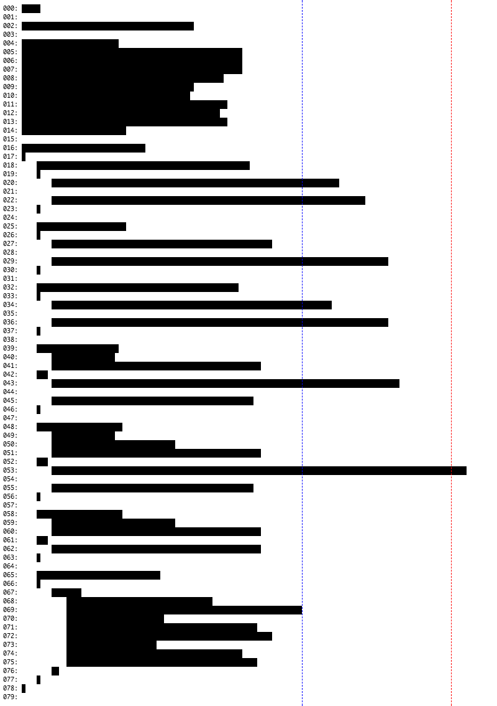
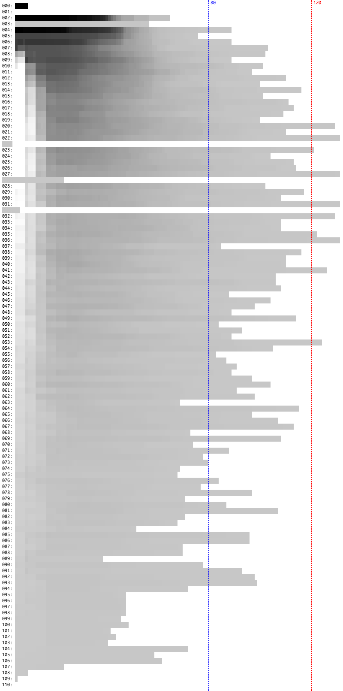

# Code outliner

You're reading code on a daily basis, code should be optimised for that. 
This tool helps you visualise how the code in your project looks, 
and might be a trigger to better structure your files.

More information about the visual perception of code here: [https://www.stitcher.io/blog/visual-perception-of-code](https://www.stitcher.io/blog/visual-perception-of-code).

## Installation

[spatie/browsershot](https://github.com/spatie/browsershot) is required to generate images. 
Please refer to the Browsershot documentation for all details, most important is to install puppeteer.

```
npm install puppeteer --global
```

You can install the package via composer:

```
composer global require spatie/code-outliner
```

## Usage

```bash
code-outliner <file> [--output=] [--extensions=]
```

### Outlining a single file

Pass a single file to the command, and you'll get output like this.



### Overlaying multiple files

Pass a directory path to the command, and it'll overlay all files on top of each other.
The darker areas represent areas where there's more code across all files.



### Filtering extensions

By default, PHP files will be scanned. 
You're able to specify other and multiple extensions with the `--extensions` option.

```php
php console.php outline --extensions="html,twig"
```

### Security

If you discover any security related issues, please email freek@spatie.be instead of using the issue tracker.

## Postcardware

You're free to use this package, but if it makes it to your production environment we highly appreciate you sending us a postcard from your hometown, mentioning which of our package(s) you are using.

Our address is: Spatie, Samberstraat 69D, 2060 Antwerp, Belgium.

We publish all received postcards [on our company website](https://spatie.be/en/opensource/postcards).

## Credits

- [Brent Roose](https://github.com/brendt)
- [All Contributors](../../contributors)

## Support us

Spatie is a webdesign agency based in Antwerp, Belgium. You'll find an overview of all our open source projects [on our website](https://spatie.be/opensource).

Does your business depend on our contributions? Reach out and support us on [Patreon](https://www.patreon.com/spatie). 
All pledges will be dedicated to allocating workforce on maintenance and new awesome stuff.

## License

The MIT License (MIT). Please see [License File](LICENSE.md) for more information.
